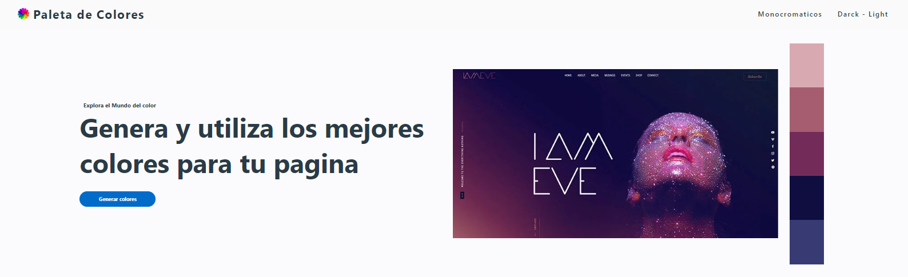
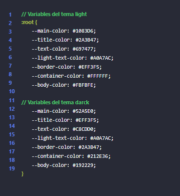

# Repo | Rincon-del-Cuervo ⭐⭐⭐⭐☆


<p align="center" style="color: white;">
    
</p>


<p>
    <a href="https://www.linkedin.com/in/juan-estaban-ar%C3%A9valo-056bab240/" target="_blank" rel="Linkedin">
      
    </a> 
    <a href="https://www.instagram.com/jeacsi.official_022?igsh=MWJ6MHRwcnhoZXVxbQ==" target="_blank" rel="Instagram">
      
    </a>
</p>
<p>
    Se ha creado una página para quienes buscan una paleta de colores monocromáticos para utilizar en sus sitios web. Esta página también proporciona información sobre cómo tener buenas combinaciones de colores mejora la experiencia del usuario, así como el diseño y la estructura de la página. Además, permite la implementación de nuevas mejoras gracias a su código abierto.
</p>

```bash
    git clone https://github.com/Juanes200122/Repo-Rincon-del-Cuervo.git
    cd Repo-Rincon-del-Cuervo
```
<div align="right">
    


</div>

<p>holaaaaaaaaaaaa</p>

<p align="right" style="color: white;">
    
</p>
